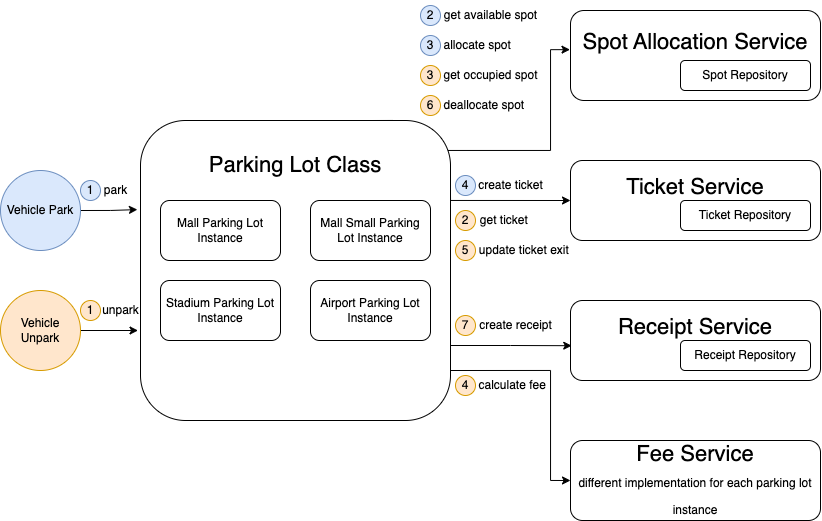

# Parking Lot Exercise

## Prerequisite
Install Node JS 18 LTS & install `yarn` globally. Run `yarn install` for the first time before running any commands.

## Simple Flow Diagram


## Unit test with coverage
```
yarn test
```

## Run Scenarios

### Example 1: Small motorcycle/scooter parking lot
Scenario is written in `scenarios/mallSmallParkingLot.test.ts`

Run below commmand to see the result
```
yarn test:mallSmallParkingLot
```


### Example 2: Mall parking lot
Scenario is written in `scenarios/mallParkingLot.test.ts`

Run below commmand to see the result
```
yarn test:mallParkingLot
```


### Example 3: Stadium Parking Lot
Scenario is written in `scenarios/stadiumParkingLot.test.ts`

Run below commmand to see the result
```
yarn test:stadiumParkingLot
```


### Example 4: Airport Parking Lot
Scenario is written in `scenarios/airportParkingLot.test.ts`

Run below commmand to see the result
```
yarn test:airportParkingLot
```


## Assumptions
1. Concurrency handling (Optimistic Locking or Pessimistic Locking) is not in scope.
2. Small vehicle can only take small spot, medium and large vehicle can only take spot in their size as well, it is feasible to make the change on spotAllocationService though
3. Database Transaction is not in scope
4. Repository layer normally should be tested in Component Test as it requires working with local database. Here it is covered by Unit Test as no database is invloved.
5. Ticket number and auto increment are handled in repository/database layer
